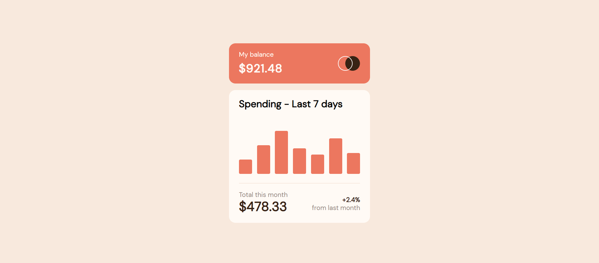

# Frontend Mentor - Expenses chart component solution

This is a solution to the [Expenses chart component challenge on Frontend Mentor](https://www.frontendmentor.io/challenges/expenses-chart-component-e7yJBUdjwt). Frontend Mentor challenges help you improve your coding skills by building realistic projects. 

## Table of contents

<!-- TOC -->

- [Frontend Mentor - Expenses chart component solution](#frontend-mentor---expenses-chart-component-solution)
    - [Table of contents](#table-of-contents)
    - [Overview](#overview)
        - [The challenge](#the-challenge)
        - [Screenshot](#screenshot)
                - [Desktop View](#desktop-view)
                - [Mobile View](#mobile-view)
        - [Links](#links)
    - [My process](#my-process)
    - [Author](#author)

<!-- /TOC -->

## Overview

### The challenge

Users should be able to:

- View the bar chart and hover over the individual bars to see the correct amounts for each day
- See the current day’s bar highlighted in a different colour to the other bars
- View the optimal layout for the content depending on their device’s screen size
- See hover states for all interactive elements on the page
- **Bonus**: Use the JSON data file provided to dynamically size the bars on the chart

### Screenshot

##### Desktop View




##### Mobile View

The Mobile view was the same as Desktop.

### Links

- Solution URL: [https://github.com/multiparedes/expensesChartComponent](https://github.com/multiparedes/expensesChartComponent)
- Live Site URL: [https://expenses-chart-component-sooty.vercel.app/](https://expenses-chart-component-sooty.vercel.app/)

## My process

For this challenge I started using SASS, the SCSS version which I found more intuitive, I also used a .JSON file for the first time and I found ir very easy to use and setup.

The challenge itself was not very dificult but I ran into the problem that I can't show the price tags when hover AND when focus, I tried using the mousein and mouseout events but them overwrites the onfocusin and onfocusout... I also tried with only CSS with the following.

```
//This is my p element with the price on it.
.pricing {
    display: none;
    //And all the tag styles.
}

//The chart-pole is the button that represents a bar.
.chart-pole:hover + .pricing {
    display: block;
}
```

All in all a good challenge that introduced me into .JSON files and the ability to focus a web arround it. 

PD: If anynone knows how to fix the hover and focus problem contact with me. :)

PD: 

After thinking about it I find a solution, the idea I had was having two price tags on the same position and active one with the mouseover-mouseout events and the other with the focusin-focusout event. With this I can trigger in an independent way and have both events working.

If anyone had found a better solution could leave me a message on FrontendMentor please ? Thanks!

## Author

- Github - [Multiparedes](https://github.com/multiparedes)
- Frontend Mentor - [@multiparedes](https://www.frontendmentor.io/profile/multiparedes)